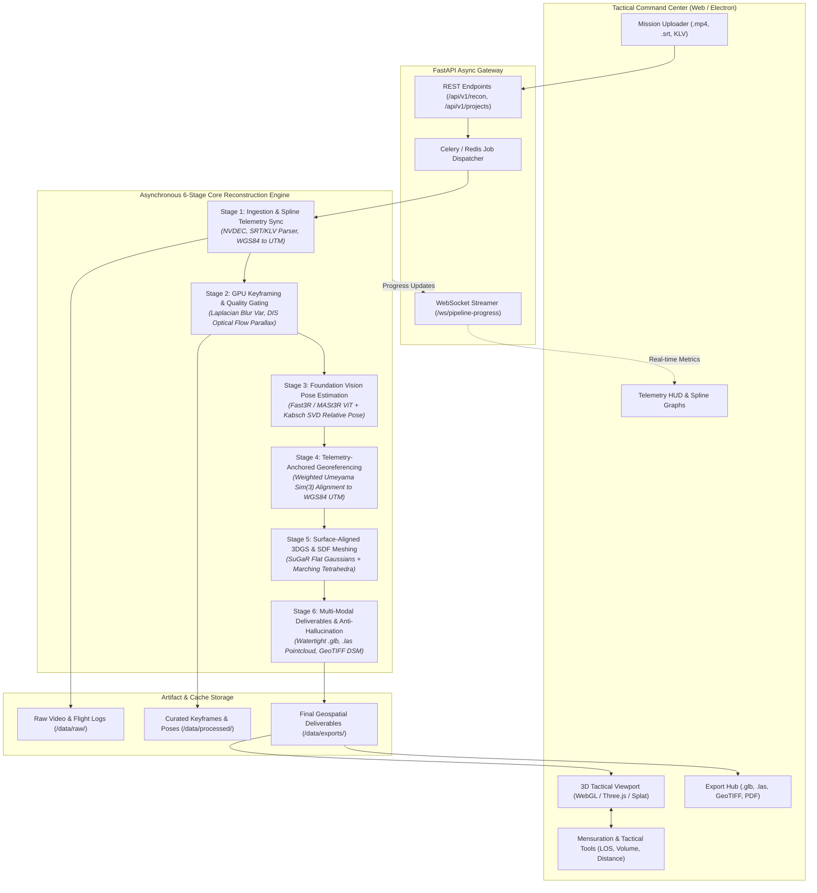

# System Architecture & Technical Specifications

## System: SIH26158 — Tactical 3D Reconstruction & Spatial Intelligence Engine
**Version:** 1.0.0-Production  
**Target Environment:** Local Defense Workstation (Single NVIDIA RTX 3090 / 4090 24GB VRAM, Ubuntu 22.04 LTS)

---

## 1. End-to-End System Pipeline & Flow

The architecture is divided into an asynchronous high-performance **Compute Pipeline** (PyTorch + CUDA C++ backends) and a responsive **Tactical Intelligence Command Interface** (FastAPI + React/Three.js WebGL).

### 1.1 Complete Architecture Diagram



---

## 2. Repository File and Folder Structure

The repository maintains strict modular decoupling between ML/CUDA processing pipelines, backend API services, tactical frontend web applications, and testing benchmarks:

```
sih2026/
├── PRD.md                                 # Product Requirements Document
├── Architecture.md                        # High-level architecture & file structure (this file)
├── Rules.md                               # AI & developer operational constraints & standards
├── Phases.md                              # Phased implementation roadmap
├── Design.md                              # UI/UX design specifications, tokens & HUD theme
├── Memory.md                              # Persistent project memory & active state tracker
├── README.md                              # Project overview & quickstart
├── docker-compose.yml                     # Unified multi-container orchestrator (backend, worker, redis, web)
├── Dockerfile.gpu                         # Production NVIDIA CUDA 12.1 + PyTorch 2.3 container
│
├── backend/                               # High-Performance Backend & Compute Engine
│   ├── pyproject.toml                     # Poetry / pip configuration & dependencies
│   ├── requirements.txt                   # Frozen python dependencies
│   ├── app/
│   │   ├── __init__.py
│   │   ├── main.py                        # FastAPI application entrypoint & middleware
│   │   ├── config.py                      # Application settings, GPU device config & paths
│   │   ├── api/                           # REST & WebSocket API routes
│   │   │   ├── __init__.py
│   │   │   ├── v1/
│   │   │   │   ├── __init__.py
│   │   │   │   ├── endpoints/
│   │   │   │   │   ├── recon.py           # Reconstruction job triggers & status
│   │   │   │   │   ├── telemetry.py       # Telemetry parsing & inspection
│   │   │   │   │   ├── viewer.py          # Model streaming & asset serving
│   │   │   │   │   ├── export.py          # Download handler for .glb, .las, .tif
│   │   │   │   │   └── analytics.py       # Mensuration & line-of-sight query endpoints
│   │   │   │   └── websocket.py           # Real-time reconstruction progress & GPU telemetry
│   │   ├── core/                          # Cross-cutting utilities
│   │   │   ├── logger.py                  # Structured defense logging
│   │   │   ├── exceptions.py              # Custom pipeline exceptions & error models
│   │   │   ├── security.py                # Air-gapped local token authentication
│   │   │   └── gpu_monitor.py             # NVML VRAM & temperature monitor
│   │   ├── schemas/                       # Pydantic data schemas
│   │   │   ├── telemetry.py               # Flight record, GPS fix, camera extrinsics
│   │   │   ├── job.py                     # Reconstruction job configurations & metrics
│   │   │   └── mensuration.py             # Geometric measurement queries & results
│   │   ├── pipeline/                      # Core 6-Stage Photogrammetric Reconstruction Engine
│   │   │   ├── __init__.py
│   │   │   ├── stage1_ingestion/          # Ingestion & Telemetry Sync
│   │   │   │   ├── video_decoder.py       # Hardware-accelerated NVDEC video frame extractor
│   │   │   │   ├── telemetry_parser.py    # Subtitle (.srt), KLV, and CSV parser
│   │   │   │   ├── spline_interpolator.py # B-spline temporal interpolator
│   │   │   │   └── geodetic.py            # WGS84 geodetic to UTM Cartesian conversion
│   │   │   ├── stage2_keyframing/         # Adaptive Keyframing & Quality Gating
│   │   │   │   ├── blur_detector.py       # GPU Laplacian variance motion blur filter
│   │   │   │   ├── flow_estimator.py      # DIS optical flow parallax & covisibility tracker
│   │   │   │   └── keyframe_selector.py   # Adaptive candidate selection controller
│   │   │   ├── stage3_foundation_pose/    # Foundation ViT & Relative Pose Estimation
│   │   │   │   ├── vit_model.py           # Fast3R / MASt3R inference wrapper
│   │   │   │   ├── pointmap_regressor.py  # Pairwise dense pointmap & confidence inference
│   │   │   │   ├── kabsch_svd.py          # Differentiable closed-form Kabsch pose solver
│   │   │   │   └── view_graph.py          # Linear view-graph alignment & gauge fixing
│   │   │   ├── stage4_georeferencing/     # Telemetry-Anchored Sim(3) Alignment
│   │   │   │   ├── umeyama_solver.py      # DOP-weighted Umeyama Sim(3) algorithm
│   │   │   │   ├── trajectory_aligner.py  # GPS trajectory to visual camera path alignment
│   │   │   │   └── metric_scaler.py       # Absolute scale factor enforcement
│   │   │   ├── stage5_surface_3dgs/       # SuGaR Surface-Regularized 3DGS & Meshing
│   │   │   │   ├── gaussian_trainer.py    # Surface-flattened 3D Gaussian optimizer
│   │   │   │   ├── sdf_extractor.py       # Signed Distance Field & Marching Tetrahedra
│   │   │   │   └── texture_baker.py       # High-resolution UV texture atlas projector
│   │   │   ├── stage6_audit_export/       # Quality Audit & Multi-Modal Exporter
│   │   │   │   ├── confidence_gate.py     # Multi-ray density auditor & void generator
│   │   │   │   ├── pointcloud_exporter.py # LAS/LAZ georeferenced point cloud generator
│   │   │   │   ├── mesh_exporter.py       # Watertight OBJ/GLTF/GLB packaging
│   │   │   │   └── raster_exporter.py     # Orthorectified GeoTIFF DSM/DTM generator
│   │   │   └── orchestrator.py            # Master asynchronous pipeline coordinator
│   │   └── workers/                       # Celery background workers
│   │       ├── celery_app.py              # Celery instance configuration
│   │       └── tasks.py                   # Async pipeline execution tasks
│
├── frontend/                              # Tactical Geospatial Web Interface
│   ├── package.json                       # React 18, Vite, Three.js dependencies
│   ├── tsconfig.json                      # Strict TypeScript compiler options
│   ├── vite.config.ts                     # Vite build configuration & proxy rules
│   ├── index.html                         # Single-page application template
│   ├── public/                            # Static assets, icons, military HUD graphics
│   └── src/
│       ├── main.tsx                       # React application bootstrap
│       ├── App.tsx                        # Root layout & mission route provider
│       ├── index.css                      # Tailwind design system & tactical HUD styles
│       ├── components/                    # Reusable tactical UI components
│       │   ├── common/                    # Button, Modal, Slider, Card, Badge, Tooltip
│       │   ├── layout/                    # Header, LeftFlightPanel, RightMetricsPanel, BottomTimeline
│       │   ├── telemetry/                 # TelemetryChart, AltitudeProfile, SpeedGauge
│       │   ├── upload/                    # FileDropzone, VideoPreview, StreamMetadataCard
│       │   └── tools/                     # DistanceRuler, VolumeBox, LineOfSightTool, HeatmapToggle
│       ├── viewers/                       # 3D Viewport Engines
│       │   ├── ViewportContainer.tsx      # Multi-mode 3D canvas container (Mesh, Splats, DSM)
│       │   ├── ThreeMeshViewer.tsx        # Three.js watertight textured .glb renderer
│       │   ├── GaussianSplatViewer.tsx    # High-speed WebGL Gaussian Splat renderer
│       │   ├── PointCloudViewer.tsx       # LAS/LAZ point cloud layer
│       │   └── CameraPathOverlay.tsx      # Visual UAV flight trajectory & orientation cones
│       ├── hooks/                         # Custom React hooks
│       │   ├── useReconstructionJob.ts    # Pipeline execution state hook
│       │   ├── useWebSocketStream.ts      # Live pipeline progress & metrics listener
│       │   ├── useThreeViewer.ts          # Camera controls, orbit, and raycasting
│       │   └── useMeasurementTools.ts     # 3D picking & mensuration logic
│       ├── stores/                        # Zustand global state stores
│       │   ├── useMissionStore.ts         # Active mission data & video metadata
│       │   ├── useViewerStore.ts          # Active rendering layer, camera state, shading mode
│       │   └── useToolStore.ts            # Active tactical tool (ruler, volume, LOS)
│       └── services/                      # API client connectors
│           ├── apiClient.ts               # Axios / Fetch client with typed endpoints
│           └── websocketClient.ts         # Resilient auto-reconnecting WebSocket client
│
├── tests/                                 # Rigorous Test Suite
│   ├── unit/                              # Unit tests for geodetic, umeyama, parser, blur
│   ├── integration/                       # Pipeline stage transitions & API endpoints
│   └── benchmarks/                        # Speed, VRAM, and scale accuracy benchmarks
│
└── data/                                  # Local Data Directory (.gitignore raw binaries)
    ├── raw/                               # Ingested UAV video & flight records
    ├── processed/                         # Extracted keyframes, masks, pointmaps
    └── exports/                           # Final .glb, .las, .tif deliverables
```

---

## 3. Technical Stack & Component Justifications

### 3.1 Backend & Machine Learning Stack
| Component | Selected Technology | Technical Rationale |
| :--- | :--- | :--- |
| **Language & Runtime** | Python 3.10+ | Native compatibility with deep learning, PyTorch 2.3+, and PyTorch C++/CUDA extensions. |
| **Deep Learning Framework** | PyTorch 2.3+ with CUDA 12.1 | Tensor compilation (`torch.compile`), FlashAttention-2, native half-precision (FP16/BF16). |
| **Foundation 3D Models** | MASt3R / Fast3R (CroCo v2 backbone) | Direct feed-forward regression of dense 3D pointmaps, eliminating slow feature matching and bundle adjustment. |
| **Surface 3DGS Engine** | SuGaR / gsplat | Planar-constrained Gaussian optimization yielding surface normals and regularized Signed Distance Fields. |
| **Hardware Video Ingestion** | PyAV / OpenCV with NVDEC | Zero-copy GPU frame decoding directly into PyTorch tensors, eliminating CPU-RAM bottlenecks. |
| **Geospatial & Mesh Stack** | Rasterio, Trimesh, Open3D, PyVista | Rigorous geodetic transformations, WGS84 UTM projection, watertightness verification, and GeoTIFF generation. |
| **Web API Framework** | FastAPI + Pydantic v2 | High-concurrency asynchronous endpoints, automatic OpenAPI schemas, native WebSockets for streaming progress. |
| **Asynchronous Task Queue** | Celery + Redis (with Local Thread Pool fallback) | Reliable asynchronous pipeline processing without blocking API HTTP responses. |

### 3.2 Frontend & Visualization Stack
| Component | Selected Technology | Technical Rationale |
| :--- | :--- | :--- |
| **Framework & Build** | React 18 + TypeScript + Vite | Instant HMR, strict type safety, modular component lifecycle. |
| **Styling & Theme** | Tailwind CSS + Custom CSS Variables | Tactical Defense Command HUD aesthetics, dark slate palette, hardware-accelerated animations. |
| **3D Rendering Engines** | Three.js + WebGL2 | High-performance client-side rendering of watertight textured meshes, camera trajectories, and measurement overlays. |
| **Gaussian Splatting Viewer** | `@mkkellogg/gaussian-splats-3d` / WebGL | 60 FPS real-time volumetric rendering of reconstructed splats directly in the browser. |
| **State Management** | Zustand | Zero-boilerplate lightweight reactive store for UI panels, flight progress, and 3D camera states. |
| **Icons & Visuals** | Lucide React | Clean, crisp military/technical vector icons. |

---

## 4. Detailed Data Flow & Stage Interaction

```
[Drone Video (.mp4) + Telemetry (.srt/KLV)]
                   │
                   ▼ (NVDEC Hardware Decode)
       Stage 1: Raw Frames + Metric Geodetic Fixes
                   │
                   ▼ (Laplacian Filter + DIS Parallax Gating)
       Stage 2: Curated Keyframes (120-250 frames)
                   │
                   ▼ (Fast3R / MASt3R ViT + Kabsch SVD)
       Stage 3: Pairwise Pointmaps & Relative Poses [R_rel | t_rel]
                   │
                   ▼ (DOP-Weighted Umeyama Sim(3))
       Stage 4: Metric UTM Camera Trajectory & Scale Factor (s)
                   │
                   ▼ (Planar SuGaR 3DGS + SDF Marching Tetrahedra)
       Stage 5: Surface Gaussians & Watertight Textured Mesh (.glb)
                   │
                   ▼ (Multi-Ray Density Audit & Cartographic Void Mask)
       Stage 6: Final Deliverables (.glb, .las, .tif, Audit Report)
                   │
                   ▼ (FastAPI / Static File Streaming)
       Tactical Web Dashboard (Interactive 3D Viewport & Tools)
```

### 4.1 Memory Management & VRAM Guard Strategy
1. **Dynamic Batching:** Pointmap generation processes image pairs in dynamically sized batches based on available VRAM queried via `torch.cuda.mem_get_info()`.
2. **Gradient Checkpointing:** Enabled during SuGaR refinement to prevent memory spikes beyond 22 GB on 24GB GPUs.
3. **Explicit Cache Eviction:** Explicit calls to `torch.cuda.empty_cache()` and garbage collection (`gc.collect()`) between pipeline stages ensure clean memory handoffs.
