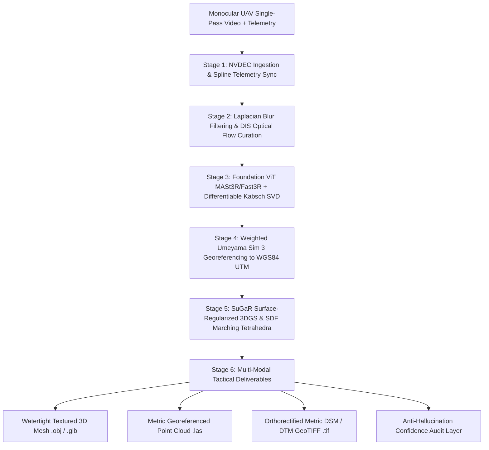

# SIH26158: Single-Pass Drone Video to Accurate 3D Model Generation System

> **Sponsoring Agency:** National Technical Research Organisation (NTRO)  
> **Challenge Track:** Smart India Hackathon 2026 (Software Track — Robotics & Drones)  
> **Category:** High-Risk, High-Reward Defense Intelligence Spatial Reconstruction  

---

## Technical Dossiers & Documentation

This repository contains the comprehensive research, theoretical foundations, mathematical proofs, and production implementation plan for **SIH26158**:

1. **[Operational and Technical Architecture Dossier](file:///run/media/askshubh/New%20Volume/Downloads/Projects/sih2026/SIH26158_Operational_and_Technical_Architecture.md)**
   - Defense intelligence operational context & problem breakdown
   - Physics of single-pass aerial capture & epipolar degeneracy ($b/H < 0.05$)
   - Photogrammetric bowl effect & $\mathrm{Sim}(3)$ gauge freedom drift
   - Detailed paradigm comparison (COLMAP/GLOMAP vs. DUSt3R/MASt3R vs. 3DGS vs. SuGaR)
   - Architectural component diagrams & SIH deliverable roadmap

2. **[Literature Synthesis and Production Implementation Plan](file:///run/media/askshubh/New%20Volume/Downloads/Projects/sih2026/SIH26158_Literature_Synthesis_and_Implementation_Plan.md)**
   - Deep feed-forward geometric vision (CroCo v2, DUSt3R, MASt3R, Fast3R)
   - Mathematical formulations for DUSt3R regression & logarithmic confidence losses
   - Surface-aligned 3D Gaussian Splatting (SuGaR) & SDF Marching Tetrahedra
   - Closed-form Differentiable Kabsch SVD relative pose solver
   - Weighted Umeyama $\mathrm{Sim}(3)$ georeferencing to WGS84 UTM with DOP weights
   - Anti-hallucination multi-ray confidence gating & cartographic void masking
   - 6-Stage Production Pipeline optimized for edge workstation GPU (RTX 4090, $<15$ min)

---

## High-Level Architecture

---

## Core Differentiators for Defense Intelligence Evaluation

- **Zero GCP Dependency:** Automated metric georeferencing via synchronous `.srt` / KLV telemetry.
- **Resilience to Single-Pass Geometry:** Foundation models bypass epipolar baseline collapse ($b/H \to 0$) and open-loop drift.
- **Watertight Metric Surfaces:** Planar-constrained Gaussians and SDF meshing eliminate floating needle artifacts inherent to vanilla 3DGS.
- **Sub-15 Minute Turnaround:** Fast3R parallel attention and accelerated SuGaR surface optimization deliver actionable geospatial intelligence within tactical flight windows.
- **Defense Anti-Hallucination Guarantee:** Strict confidence gating and ray-density verification flag unobserved regions as voids rather than generating synthetic geometry.
