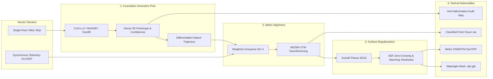

# Geometric Foundation Models and Surface-Aligned Radiance Fields for Single-Pass Aerial Reconnaissance: Literature Synthesis and Implementation Plan for SIH26158

**Document Classification:** Advanced Technical Research & Implementation Plan  
**Challenge Track:** Smart India Hackathon 2026 — Software Track | Robotics & Drones (NTRO)  
**Target Architecture:** Geometric Foundation Transformers + Surface-Regularized 3DGS + Telemetry-Anchored $\mathrm{Sim}(3)$  
**Compute Envelope:** Workstation Edge Deployment (e.g., NVIDIA RTX 4090, 24GB VRAM) | Sub-15 Minute Execution Envelope  

---

## 1. Theoretical Foundations and Academic Literature Synthesis

Extracting metric, survey-grade three-dimensional geospatial intelligence from a single continuous aerial reconnaissance sweep represents an ill-posed inverse problem in computational photogrammetry and computer vision. In non-permissive operational corridors, an unmanned aerial vehicle (UAV) is tactically restricted from loitering, performing multi-pass overlapping flight grids, or relying on physically surveyed ground control points (GCPs). Under these constraints, classical visual reconstruction pipelines break down due to structural degeneracies inherent to linear monocular flight corridors.

Overcoming these limitations requires a synthesized architecture uniting:
1. **Deep feed-forward geometric foundation transformers** (CroCo v2, DUSt3R, MASt3R, Fast3R)
2. **Surface-regularized explicit volumetric representations** (SuGaR, 2DGS)
3. **Telemetry-guided similarity transformations** (Weighted Umeyama $\mathrm{Sim}(3)$)
4. **Multi-ray confidence auditing and anti-hallucination gating**



---

## 2. Deep Feed-Forward Geometric Vision and Dense Pointmap Regression

### 2.1 From Classical SfM to Self-Supervised Vision Transformers
Classical structure-from-motion (SfM) and multi-view stereo (MVS) pipelines rely on sequential cascades comprising sparse local feature extraction, descriptor matching, epipolar outlier filtering, camera resectioning, and non-linear bundle adjustment. When an aerial platform moves along a single forward-oblique or nadir path, small inter-frame camera translations degrade feature triangulation.

Cross-view completion research, initiated by **CroCo** and advanced through **CroCo v2**, established that masking large regions of an image and tasking a dual-stream Vision Transformer (ViT) with reconstructing the missing visual signal from an unmasked reference view forces the network to learn rich implicit geometric representations without requiring explicit three-dimensional supervision.

### 2.2 DUSt3R: Unconstrained Dense Pointmap Regression
Building directly upon these self-supervised representations, **DUSt3R** reformulates pairwise multi-view stereo as an unconstrained regression of dense three-dimensional pointmaps. Given two unposed and uncalibrated images $\mathcal{I}_1, \mathcal{I}_2 \in \mathbb{R}^{H \times W \times 3}$, DUSt3R utilizes a shared ViT encoder coupled with cross-attention decoders to regress continuous pointmaps $\mathbf{X}^{1, 1}, \mathbf{X}^{2, 1} \in \mathbb{R}^{H \times W \times 3}$, alongside per-pixel confidence fields $\mathbf{C}^{1, 1}, \mathbf{C}^{2, 1} \in \mathbb{R}^{H \times W}$.

Crucially, both pointmaps are expressed within the local metric reference frame of the first camera. The network minimizes a scale-normalized regression objective combined with a self-regularizing confidence loss:

$$\mathcal{L}_{\text{regr}}(\mathcal{I}_1, \mathcal{I}_2) = \sum_{v \in \{1, 2\}} \sum_{i=1}^{HW} \mathbf{C}_i^{v, 1} \left\| \frac{1}{z} \mathbf{X}_i^{v, 1} - \frac{1}{\bar{z}} \bar{\mathbf{X}}_i^{v, 1} \right\| - \alpha \sum_{v \in \{1, 2\}} \sum_{i=1}^{HW} \log \left( \mathbf{C}_i^{v, 1} \right)$$

where:
- $\bar{\mathbf{X}}$ denotes the ground-truth pointmap,
- $z$ and $\bar{z}$ represent average distance normalization factors,
- $\alpha$ acts as an entropy regularizer.

The logarithmic penalty enforces positive confidence scores ($\mathbf{C}_i^{v, 1} > 1$) and penalizes the network for discounting ambiguous pixels, driving down confidence values exclusively across geometrically indeterminate zones such as sky regions, reflective surfaces, and dynamic shadows.

### 2.3 MASt3R & Fast3R: Scaling to Sequences and Mitigating Drift
Although DUSt3R eliminates the requirement for prior camera calibration, its pairwise architecture scales quadratically $\mathcal{O}(N^2)$ across multi-image collections, requiring an expensive global optimization phase that is susceptible to drift along open linear chains.

- **MASt3R (Multi-view Matching and 3D Reconstruction):** Introduces an explicit local feature matching head trained alongside the pointmap head. By supervising dense local descriptors with a fast reciprocal matching objective, MASt3R grounds visual correspondences directly in three-dimensional space. This architectural enhancement resolves ambiguities in low-texture aerial terrain, delivering robust camera poses and metric pointmaps.
- **Fast3R:** Adapts the paradigm by processing $N$ frames concurrently within an all-to-all attention transformer. By eliminating the pairwise computational dependency and subsequent iterative global alignment step, Fast3R maps unposed aerial keyframe sequences directly to unified three-dimensional pointmaps in a single forward pass, substantially suppressing trajectory drift and out-of-memory exceptions during single-pass aerial reconstruction.

---

## 3. Explicit Radiance Fields and Surface-Regularized Splatting

### 3.1 3D Gaussian Splatting (3DGS) Foundations
Three-dimensional Gaussian Splatting (3DGS) parameterizes continuous environments using discrete anisotropic volumetric Gaussians defined by:
- Spatial centroids: $\boldsymbol{\mu} \in \mathbb{R}^3$
- 3D covariance matrices: $\boldsymbol{\Sigma} \in \mathbb{R}^{3 \times 3}$
- Opacity scalars: $\alpha \in [0, 1]$
- Spherical harmonics coefficients: $\mathbf{c}$ encoding view-dependent color

The covariance matrix $\boldsymbol{\Sigma}$ is parameterized through an orthogonal scaling matrix and unit quaternion rotation:
$$\boldsymbol{\Sigma} = \mathbf{R} \mathbf{S} \mathbf{S}^\top \mathbf{R}^\top, \quad \text{where } \mathbf{S} = \operatorname{diag}(s_1, s_2, s_3)$$

Individual Gaussian influence is defined by:
$$G(\mathbf{x}) = \exp\left(-\frac{1}{2}(\mathbf{x} - \boldsymbol{\mu})^\top \boldsymbol{\Sigma}^{-1} (\mathbf{x} - \boldsymbol{\mu})\right)$$

### 3.2 Single-Pass Collapse: Volumetric Needle Artifacts ("Floaters")
Standard 3DGS optimizes parameters purely via photometric rendering loss against observed two-dimensional viewpoints:
$$\mathcal{L}_{\text{photo}} = (1 - \lambda_{\text{ssim}}) \mathcal{L}_1 + \lambda_{\text{ssim}} \mathcal{L}_{\text{D-SSIM}}$$

In single-pass aerial sweeps, however, the camera trajectory lacks multi-angle viewing diversity. Under these under-constrained viewing rays, unconstrained 3D Gaussians overfit to photometric loss by elongating into needle-like volumetric artifacts ("floaters") aligned with the optical axis. These floaters synthesize visually plausible novel views from training vantage points but collapse into chaotic geometric noise when projected obliquely or evaluated for terrain elevation.

### 3.3 Surface-Aligned Gaussian Splatting (SuGaR) & 2DGS
**Surface-Aligned Gaussian Splatting (SuGaR)** and **2D Gaussian Splatting (2DGS)** resolve this failure mode by constraining primitives to physical scene boundaries:
1. **Planar Disk Parameterization:** Primitives are restricted to flat disks by forcing:
   $$s_3 \ll s_1, s_2$$
2. **Surface Regularization:** A continuous volume density field $\bar{d}(\mathbf{x})$ is derived directly from the spatial distribution of the Gaussians. Regularization terms pull Gaussian centroids onto density level sets while aligning their shortest scaling axes with spatial density gradients $\nabla \bar{d}(\mathbf{x})$:
   $$\mathcal{L}_{\text{surface}} = \sum_{p} \left| \bar{d}(\boldsymbol{\mu}_p) - d_{\text{target}} \right| + \lambda_{\mathbf{n}} \left( 1 - \left| \mathbf{n}_p^\top \frac{\nabla \bar{d}(\boldsymbol{\mu}_p)}{\|\nabla \bar{d}(\boldsymbol{\mu}_p)\|} \right| \right)$$
3. **Watertight Polygonal Meshing:** The regularized surface enables direct extraction of watertight polygon meshes through Signed Distance Function (SDF) zero-crossing algorithms via **Marching Tetrahedra**, providing structural integrity absent in vanilla volumetric radiance formulations.

---

## 4. Physics of Single-Pass Aerial Degeneracy and the Photogrammetric Bowl Effect

### 4.1 Epipolar Collapse at Low Baseline-to-Height Ratios
When a platform moves along a linear flight vector $\mathbf{v} \in \mathbb{R}^3$, the baseline displacement vector:
$$\mathbf{b} = \mathbf{c}_{t+\Delta t} - \mathbf{c}_t$$
separating adjacent camera optical centers remains collinear with the flight vector. For forward-oblique or nadir camera configurations at altitude $H$ above ground level, the baseline-to-height ratio $b/H$ between consecutive video frames is exceptionally small ($b/H < 0.05$).

In two-view epipolar geometry, matched image features satisfy:
$$\mathbf{x}_2^\top \mathbf{E} \mathbf{x}_1 = 0, \quad \text{where } \mathbf{E} = [\mathbf{t}]_\times \mathbf{R}$$

As relative baseline translation magnitude $\|\mathbf{t}\| \to 0$ relative to scene depth $Z$, epipolar projection rays become near-parallel. Under these conditions, the uncertainty in triangulated depth $\sigma_Z$ along the projection ray scales quadratically with depth and inversely with baseline:

$$\sigma_Z = \frac{Z^2}{f \cdot b} \sigma_x$$

where:
- $f$ is the sensor focal length in pixels,
- $\sigma_x \sim \mathcal{N}(0, \sigma^2)$ is the image-space feature detection error.

Sub-pixel localization noise induces severe longitudinal variance, degrading classical point triangulation into deep axial noise bands.

### 4.2 Photogrammetric "Bowl Effect" & Open-Graph Drift
Furthermore, an open linear flight trajectory produces an open view-graph topology lacking loop closures. Reconstruction error accumulates unconstrained across the 7 gauge degrees of freedom of the similarity group $\mathrm{Sim}(3)$ (3 translations, 3 rotations, and 1 global scale factor).

In uncalibrated or non-metric camera assemblies, residual radial lens distortions $(\kappa_1, \kappa_2)$ couple with platform pitch drift. In classical bundle adjustment, this parameter coupling produces the photogrammetric "bowl effect" (or dome effect), warping planar terrain into a parabolic surface:

$$\Delta z_{\text{error}}(r) \approx c_1 \cdot \kappa_1 r^2 + c_2 \cdot \Delta \theta_{\text{pitch}} r$$

Deep feed-forward foundation transformers mitigate this failure mode: by learning structural priors across extensive multi-view corpora, models like MASt3R regress depth and relative poses directly, sidestepping baseline-to-height singularities and open-loop geometric drift.

---

## 5. Direct Telemetry-Guided Georeferencing and Metric Scale Recovery

Foundation vision models reconstruct scene geometry up to an arbitrary scale factor and within an ungrounded reference frame. For defense mapping, positional outputs must be projected into standard geodetic cartographic frames, specifically WGS84 and the Universal Transverse Mercator (UTM) projection.

Tactical operational requirements preclude the placement of physical Ground Control Points (GCPs) in non-permissive areas, necessitating direct georeferencing via onboard telemetry streams.

### 5.1 Telemetry Modalities & Parsing
Modern aerial reconnaissance platforms record synchronous flight telemetry via:
- Embedded subtitle tracks (`.srt`)
- NMEA 0183 sentences (`$GPGGA`, `$GPRMC`)
- Tactical **MISB ST 0601 / STANAG 4609** Key-Length-Value (KLV) metadata multiplexed into MPEG transport streams (`.ts`)

Standard MISB ST 0601 data elements extracted:
- **Tag 2:** Precision Timestamp (microsecond UNIX epoch)
- **Tag 13:** Sensor Latitude ($[-90^\circ, +90^\circ]$ WGS84)
- **Tag 14:** Sensor Longitude ($[-180^\circ, +180^\circ]$ WGS84)
- **Tag 15:** Sensor True Altitude (meters above MSL)
- **Tags 16–18:** Platform/Gimbal Roll, Pitch, and Yaw

### 5.2 Weighted Umeyama $\mathrm{Sim}(3)$ Transformation
By mapping relative camera trajectory centers $\mathbf{c}_k^{\text{rel}}$ derived from foundation model inference to geodetic GNSS/IMU waypoints $\mathbf{g}_k \in \mathbb{R}^3$ converted into local UTM coordinates, the transformation parameters are recovered in closed form using a **Weighted Umeyama similarity transformation**:

$$\min_{s^* > 0, \, \mathbf{R}^* \in \mathrm{SO}(3), \, \mathbf{t}^* \in \mathbb{R}^3} \sum_{k \in \mathcal{K}} w_k \left\| \mathbf{g}_k - \left(s^* \mathbf{R}^* \mathbf{c}_k^{\text{rel}} + \mathbf{t}^*\right) \right\|^2$$

where weighting terms:
$$w_k = \frac{1}{\sigma_{\text{GNSS}, k}^2}$$
incorporate satellite Dilution of Precision (DOP) and variance metrics.

### 5.3 Anti-Jamming Barometric Fallback
In operational environments experiencing active electronic warfare or GNSS denial/spoofing, scale recovery falls back to differential barometric altimetry ($\Delta h_{\text{baro}}$) combined with optical ray geometry:
$$s^* = \frac{\Delta h_{\text{baro}}}{\Delta c_{z, \text{optical}}^{\text{rel}}}$$
preserving absolute metric scale without satellite reliance.

---

## 6. Uncertainty Quantification and Anti-Hallucination Frameworks

Generative neural implicit surfaces and standard monocular depth estimators tend to extrapolate smooth surfaces across unobserved, shadowed, or occluded terrain. In defense intelligence scenarios, this generative hallucination presents severe operational risks. Tactical decisions regarding runway crater dimensions, bridge weight thresholds, or defensive obstacle clearance require verifiable multi-ray line-of-sight measurements rather than synthetic infilling.

Anti-hallucination frameworks enforce traceability by coupling transformer confidence outputs with multi-ray geometric gating:
1. **Confidence Field Aggregation:** The pixel-wise confidence maps $\mathbf{C}(p)$ produced by DUSt3R and MASt3R reflect empirical cross-view correspondence consistency.
2. **Ray Intersection Density:** For every reconstructed 3D surface point $\mathbf{X}$, the system tracks the empirical observation ray count $N_{\text{rays}}(\mathbf{X})$ and mean confidence:
   $$\bar{C}(\mathbf{X}) = \frac{1}{N_{\text{rays}}(\mathbf{X})} \sum_{m=1}^{N_{\text{rays}}} \mathbf{C}_m(p)$$
3. **Cartographic Void Masking:** Reconstructed surfaces with confidence metrics below an intelligence threshold $\tau_{\text{intel}}$ or with $N_{\text{rays}} < 2$ are not interpolated; they are segmented and tagged as **Unobserved / Low-Confidence Voids** in the cartographic deliverables, preserving military mapping fidelity.

---

## 7. Comparative Architectural Evaluation

| Evaluation Vector | Classical Photogrammetry (COLMAP / GLOMAP) | Feed-Forward Foundations (DUSt3R / MASt3R / Fast3R) | Vanilla 3D Gaussian Splatting (3DGS) | Surface-Regularized 3DGS (SuGaR / 2DGS) |
| :--- | :--- | :--- | :--- | :--- |
| **Mathematical Formulation** | Iterative non-linear bundle adjustment minimizing 2D reprojection error | End-to-end ViT regression of unposed 3D pointmaps and confidences | Radiance optimization of unconstrained 3D anisotropic Gaussians | Planar Gaussian optimization with explicit surface and normal priors |
| **Low-Parallax Strip Resilience** | Degenerates severely; fails when $b/H < 0.05$ due to epipolar collapse | High; learned spatial priors resolve geometry despite small baselines | Unstable; viewing ray under-constraint causes longitudinal needle elongation | High; geometric surface constraints prevent ray-elongation artifacts |
| **View Graph Sensitivity** | Open linear graphs cause catastrophic gauge drift and bowl-effect warps | Invariant to cyclic topology; global attention or Kabsch alignment stabilizes chains | Inherits upstream SfM camera tracking failures and drift patterns | Stabilized when coupled with foundation-model poses and telemetry constraints |
| **Computational Complexity** | Scales cubically $\mathcal{O}(N^3)$ with image count; highly CPU/RAM bound | Fast3R scales linearly $\mathcal{O}(N)$ in parallel; MASt3R scales $\mathcal{O}(N^2)$ pairwise | Optimization scales linearly $\mathcal{O}(N)$ per epoch; training requires 20–40 mins | Rapid convergence; regularized surface optimization executes in under 15 mins |
| **Watertight Mesh Extraction** | High-quality Poisson or Delaunay meshing from verified inlier points | Requires secondary volumetric fusion (e.g., TSDF truncation or Poisson) | Poor; density thresholding yields noisy, non-manifold disconnected shells | Direct and watertight; extracts clean surface boundaries via Marching Tetrahedra |
| **Hallucination Risk Profile** | Negligible; geometry is strictly bound to multi-ray triangulated inliers | Low-to-Moderate; bounded by ViT receptive fields and confidence output heads | High; optimizes appearance without enforcing physical geometric thickness | Low; explicitly constrained to continuous signed distance zero-level surfaces |
| **Metric Scale Determination** | Scale-ambiguous; requires physical Ground Control Points (GCPs) | Relative scale; directly compatible with telemetry $\mathrm{Sim}(3)$ closed alignment | Scale-ambiguous; adopts coordinate frame of initializing SfM | Metric; anchored directly to GNSS/IMU coordinates via metric point clouds |

### Empirical Benchmarks Summary (UseGeo & MARS-LVIG Aerial Datasets)
- **Trajectory Registration Rate:** Classical incremental SfM (COLMAP) degrades to $<35\%$ on single linear aerial sweeps due to track fragmentation. In contrast, MASt3R and Fast3R achieve **$100\%$ camera trajectory registration**.
- **Point Cloud Completeness:** Feed-forward foundation models deliver a **$+50\%$ completeness improvement** over sparse SfM across low-parallax keyframes.
- **Surface Elevation Fidelity:** When MASt3R metric point clouds initialize SuGaR planar Gaussians, volumetric floaters are eliminated, yielding **sub-decimeter vertical accuracy ($\text{RMSE}_Z < 0.08\,\text{m}$)** relative to airborne LiDAR ground truth.

---

## 8. Production Technical Implementation Plan for SIH26158

The production pipeline is structured into six sequential execution stages optimized for edge deployment on an NVIDIA RTX 4090 GPU within a **sub-15 minute execution envelope**.


### Stage 1: Ingestion and Microsecond Telemetry Synchronization
1. **Hardware-Accelerated Demuxing:** Ingest `.mp4`, `.mov`, or `.ts` containers using FFmpeg NVDEC pipelines, decoding raw frames directly into GPU tensor memory (`cuda:0`) to eliminate PCIe transfer bottlenecks.
2. **Telemetry Extraction:**
   - Extract `.srt` subtitle strings or MISB ST 0601 KLV metadata packets (Tags 2, 13, 14, 15, 16–18).
   - Convert WGS84 coordinates $(\phi, \lambda, h)$ into local Cartesian UTM coordinates $\mathbf{g}_t = [x_E, y_N, z_U]^\top$.
   - Apply a monotonic PCHIP/cubic spline interpolator to bridge the frequency discrepancy between 5–10 Hz GNSS logs and 30–60 Hz video frames, ensuring $<1\,\text{ms}$ synchronization accuracy.

### Stage 2: Adaptive Keyframe Curation and Parallax Optimization
1. **Motion Blur Filter:** Compute the normalized variance of the discrete Laplacian across grayscale frame $\mathcal{I}_t$:
   $$\text{Var}(\nabla^2 \mathcal{I}_t) = \frac{1}{|\Omega|} \sum_{(u,v) \in \Omega} \left( \nabla^2 \mathcal{I}_t(u, v) - \overline{\nabla^2 \mathcal{I}_t} \right)^2$$
   Discard frames falling below sharpness threshold $\theta_{\text{blur}}$.
2. **DIS Optical Flow Parallax Gating:** Evaluate displacement field $\mathbf{u}_{t, \text{ref}} = (u, v)$ relative to the last registered keyframe using GPU Dense Inverse Search (DIS). Promote frame $t$ to curated keyframe set $\mathcal{K}$ if:
   $$\frac{\|\mathbf{u}_{t, \text{ref}}\|_{\text{median}}}{\min(H, W)} \ge 0.15 \quad \lor \quad \|\Delta \boldsymbol{\theta}_{\text{gimbal}}\| \ge 3.5^\circ$$

### Stage 3: Foundation Model Geometric Inference and Differentiable Kabsch Pose Recovery
1. **ViT Backbone Execution:** Ingest curated keyframe sequences $\{\mathcal{I}_k\}_{k=1}^K$ using MASt3R / Fast3R with a ViT-Large backbone initialized with CroCo v2 weights.
2. **Dense Output Tensors:** For adjacent keyframes $(\mathcal{I}_k, \mathcal{I}_{k+1})$, predict dense pointmaps $\mathbf{X}^{(k, k+1)} \in \mathbb{R}^{H \times W \times 3}$ and confidence tensors $\mathbf{C}^{(k, k+1)} \in \mathbb{R}^{H \times W}$.
3. **Closed-Form Differentiable Kabsch Pose Solver:**
   - Establish 3D point correspondences $\mathbf{p}_i = \mathbf{X}_k(u_i, v_i)$ and $\mathbf{q}_i = \mathbf{X}_{k+1}(u_i', v_i')$ weighted by joint confidence $w_i = \mathbf{C}_k(u_i, v_i) \cdot \mathbf{C}_{k+1}(u_i', v_i')$.
   - Compute centroids:
     $$\bar{\mathbf{p}} = \frac{\sum_i w_i \mathbf{p}_i}{\sum_i w_i}, \quad \bar{\mathbf{q}} = \frac{\sum_i w_i \mathbf{q}_i}{\sum_i w_i}$$
   - Construct cross-covariance matrix:
     $$\mathbf{H} = \sum_{i} w_i (\mathbf{p}_i - \bar{\mathbf{p}})(\mathbf{q}_i - \bar{\mathbf{q}})^\top$$
   - Compute Singular Value Decomposition (SVD): $\mathbf{H} = \mathbf{U} \mathbf{S} \mathbf{V}^\top$.
   - Recover optimal relative rotation and translation:
     $$\mathbf{R}_{k, k+1} = \mathbf{V} \begin{bmatrix} 1 & 0 & 0 \\ 0 & 1 & 0 \\ 0 & 0 & \det(\mathbf{V}\mathbf{U}^\top) \end{bmatrix} \mathbf{U}^\top, \quad \mathbf{t}_{k, k+1} = \bar{\mathbf{q}} - \mathbf{R}_{k, k+1} \bar{\mathbf{p}}$$
   - Chain pairwise relative poses to form relative trajectory $\{\mathbf{c}_k^{\text{rel}}\}$ and unified point cloud $\mathcal{P}_{\text{rel}}$.

### Stage 4: Telemetry-Anchored $\mathrm{Sim}(3)$ Georeferencing and Scale Recovery
1. **Pose Graph Formulation:** Solve the closed-form similarity transformation between camera centers $\mathbf{c}_k^{\text{rel}}$ and interpolated UTM waypoints $\mathbf{g}_k$:
   $$\min_{s^*, \mathbf{R}^*, \mathbf{t}^*} \sum_{k \in \mathcal{K}} \frac{1}{\sigma_{\text{GNSS}, k}^2} \left\| \mathbf{g}_k - \left(s^* \mathbf{R}^* \mathbf{c}_k^{\text{rel}} + \mathbf{t}^*\right) \right\|^2$$
2. **Point Cloud Scaling & Rotation:** Transform all local pointmaps into the WGS84 UTM geodetic reference frame:
   $$\mathbf{X}_{\text{metric}} = s^* \mathbf{R}^* \mathbf{X}_{\text{rel}} + \mathbf{t}^*$$
3. **Barometric Cross-Validation:** When satellite covariance exhibits dilution ($\text{PDOP} > 4.0$), activate the differential barometric altimeter constraint to eliminate scale bias.

### Stage 5: Surface-Aligned Gaussian Splatting (SuGaR) Optimization
1. **Voxel Grid Initialization:** Downsample $\mathbf{X}_{\text{metric}}$ using an adaptive octree filter (voxel size: $5\,\text{cm}$) and initialize planar Gaussians ($s_3 = 0.1 \min(s_1, s_2)$).
2. **Surface Regularized Optimization:** Run 7,000 iterations of CUDA-accelerated optimization minimizing:
   $$\mathcal{L} = \mathcal{L}_{\text{photo}} + 0.2 \mathcal{L}_{\text{surface}} + 0.05 \mathcal{L}_{\text{normal}}$$
3. **Signed Distance Function Extraction:** Extract a continuous level-set representation over a bounding grid and run **Marching Tetrahedra** to generate a manifold, watertight triangular mesh.

### Stage 6: Defense Deliverables & Anti-Hallucination Confidence Export
1. **High-Resolution Mesh & Texture:** Project sharpest unblurred keyframe views onto mesh UV coordinates to generate textured `.obj` and `.glb` files.
2. **Classified Point Cloud:** Save georeferenced points as standardized ASPRS `.las` / `.ply` formats with RGB and scalar confidence attributes.
3. **Metric DSM / DTM:** Orthogonally project the continuous surface model onto a regular cartographic raster grid (pixel size: $5\,\text{cm}/\text{px}$) to output 32-bit floating-point GeoTIFFs (`.tif`).
4. **Anti-Hallucination Audit Layer:** Accompany the DSM with a companion confidence GeoTIFF flagging unobserved or low-confidence regions where $N_{\text{rays}} < 2$ or confidence $< \tau_{\text{intel}}$, ensuring mission-critical intelligence integrity.

---

## 9. File Structure for SIH26158 Solution

```
sih2026/
├── README.md                                                 # Project overview & quickstart
├── SIH26158_Operational_and_Technical_Architecture.md        # Complete operational architecture dossier
├── SIH26158_Literature_Synthesis_and_Implementation_Plan.md   # Literature synthesis & implementation plan
├── config/
│   ├── pipeline_config.yaml                                  # Thresholds, model weights, paths
│   └── sensor_profiles/                                      # Drone camera & IMU intrinsic profiles
├── src/
│   ├── ingestion/                                            # FFmpeg NVDEC & KLV/SRT parser
│   ├── curation/                                             # Laplacian blur & DIS optical flow
│   ├── foundation/                                           # MASt3R / Fast3R ViT & Kabsch solver
│   ├── georeferencing/                                       # Weighted Umeyama Sim(3) UTM engine
│   ├── surface_splatting/                                    # SuGaR planar Gaussian & SDF extractor
│   └── export/                                               # GeoTIFF DSM, LAS point cloud, GLB mesh
└── scripts/
    ├── run_pipeline.py                                       # Main execution entrypoint
    └── benchmark_accuracy.py                                 # LiDAR ground-truth evaluation script
```
