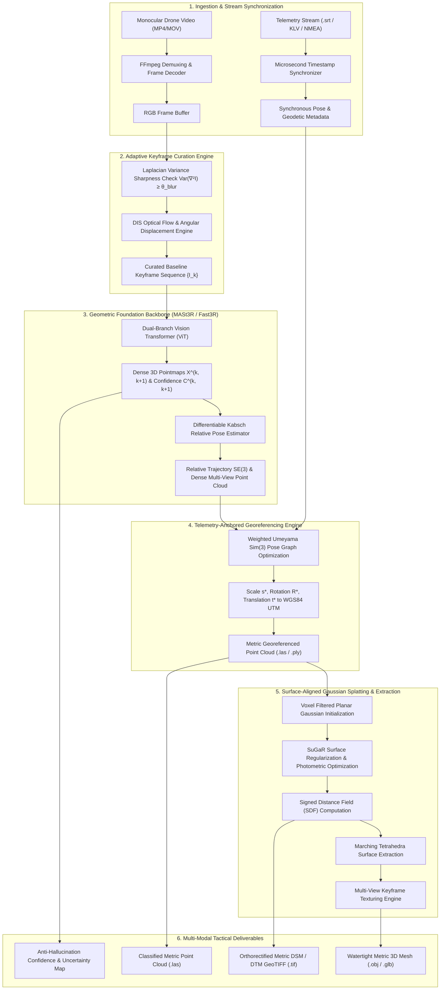

# Operational and Technical Architecture for SIH26158: Single-Pass Drone Video to Accurate 3D Model Generation System

**Problem Statement:** SIH26158  
**Title:** Single-Pass Drone Video to Accurate 3D Model Generation System  
**Sponsoring Agency:** National Technical Research Organisation (NTRO)  
**Track & Domain:** Smart India Hackathon 2026 — Software Track | Robotics & Drones  
**Assessment Focus:** Geodetic Metric Accuracy, Sub-minute Latency, Suppression of Geometric Hallucination  

---

## 1. Executive Problem Dossier & Defense Intelligence Context

### 1.1 Tactical Operational Realities
Problem statement **SIH26158**, designated under the title *"Single-Pass Drone Video to Accurate 3D Model Generation System,"* represents a specialized defense-oriented challenge issued by the **National Technical Research Organisation (NTRO)** under the Prime Minister's Office of India. NTRO requires computational systems capable of extracting actionable spatial intelligence from constrained tactical reconnaissance flights.

In contested, non-permissive, or radar-monitored border zones, aerial platforms cannot execute conventional aerial photogrammetry:
- **Civilian Survey Baseline:** Standard survey doctrines mandate multi-pass flight profiles (e.g., double-grid "lawnmower" patterns) featuring $70\%\text{--}80\%$ longitudinal endlap and lateral sidelap, alongside pre-surveyed ground control points (GCPs) established by ground survey teams.
- **Hostile Tactical Corridor Baseline:** Loitering over an area of interest dramatically elevates radar cross-section signatures and exposure to anti-aircraft fire/MANPADS. A tactical unmanned aerial vehicle (UAV) must execute a rapid **single-pass sweep**—navigating an approximately linear or sweeping trajectory across an area of interest—and egress immediately.
- **Core Engineering Mandate:** Transform continuous, monocular aerial video from a single flight vector into high-fidelity, georeferenced, metric 3D representations (textured meshes, point clouds, and Digital Surface Models) without human ground intervention, pre-placed GCPs, or multi-pass redundancy.

### 1.2 Competitive Landscape & Defense Evaluation Criteria
Within the Smart India Hackathon ecosystem, SIH26158 is categorized as a high-risk, high-reward problem with an estimated competitive pool of 110–250 teams. The acute difficulty stems from severe geometric under-constrainedness:

1. **Failure of Commercial Off-The-Shelf (COTS) Photogrammetry:** Commercial engines (e.g., Agisoft Metashape, Pix4D, RealityCapture) collapse on single linear passes due to lack of topological loop closures, low visual parallax, and unanchored scale, inducing severe drift or track fragmentation.
2. **Zero-Tolerance for Generative Hallucinations:** Unlike civilian visual media where visually plausible synthetic detail is acceptable, defense intelligence requires verifiable spatial fidelity. Tactical decisions (such as bridge weight clearance, runway crater depth, or parapet heights) depend on empirical multi-ray intersection and quantifiable confidence metrics rather than hallucinated generative geometry.

---

## 2. Operational Specification Matrix

| Attribute | System Requirement & Operational Specification |
| :--- | :--- |
| **Problem Statement Identifier** | SIH26158 |
| **Official Challenge Title** | Single-Pass Drone Video to Accurate 3D Model Generation System |
| **Sponsoring Agency** | National Technical Research Organisation (NTRO) |
| **Edition & Competitive Track** | Smart India Hackathon 2026, Software Track |
| **Assigned Thematic Domain** | Robotics and Drones |
| **Primary Video Input Modality** | Uncalibrated or Calibrated Monocular RGB Video (Single Linear/Sweeping Strip) |
| **Synchronous Telemetry Modality**| Subtitle Telemetry (`.srt`), KLV Embedded Metadata, or NMEA Geodetic Strings |
| **Expected Structural Outputs** | Georeferenced Point Clouds (`.las`/`.ply`), Textured Meshes (`.obj`/`.glb`), Metric DSM/DTM (`.tif`) |
| **Mandatory SIH Deliverables** | Public Repository, Setup Documentation, 2-Page Architecture, 2-Minute Video, 5-Slide Pitch |
| **Core Assessment Metrics** | Geodetic Metric Accuracy, Processing Latency, Suppression of Geometric Hallucinations |

---

## 3. Geometric Degeneracies & Physics of Single-Pass Aerial Capture

### 3.1 Epipolar Collapse & Low Parallax Geometry
When an aerial platform moves along a linear flight vector $\mathbf{v} \in \mathbb{R}^3$, the baseline vector:
$$\mathbf{b} = \mathbf{c}_{t+\Delta t} - \mathbf{c}_t$$
separating consecutive camera centers is largely collinear with the optical axis in forward-oblique orientations, or parallel to the terrain in nadir orientations. Consequently, the baseline-to-height ratio $b/H$ remains exceptionally small across consecutive video frames.

In two-view epipolar geometry, correspondences satisfy:
$$\mathbf{x}_2^\top \mathbf{E} \mathbf{x}_1 = 0, \quad \text{where } \mathbf{E} = [\mathbf{t}]_\times \mathbf{R}$$
As the baseline translation $\mathbf{t} \to 0$ relative to scene depth $Z$, the epipolar rays passing through matched features become near-parallel. The uncertainty in triangulated depth $\sigma_Z$ along the optical projection ray scales quadratically with depth and inversely with baseline:

$$\sigma_Z = \frac{Z^2}{f \cdot b} \sigma_x$$

Where:
- $Z$ = Scene depth / flying height above ground level (AGL)
- $f$ = Sensor focal length in pixels
- $b$ = Physical camera baseline between observation frames
- $\sigma_x \sim \mathcal{N}(0, \sigma^2)$ = Image-space feature detection localization uncertainty

Because of this quadratic relationship, minor sub-pixel feature detection noise induces catastrophic variance along the depth coordinate, causing classical two-view triangulation to degenerate into extreme longitudinal noise.

```
Low-Parallax Aerial Ray Intersection Degeneracy:
Camera C1          Camera C2 (Baseline b ≈ 0 relative to depth Z)
   [o]================[o]
    \                 /   <--- Near-parallel rays
     \               /
      \             /     Depth Uncertainty σ_Z ∝ Z² / (f · b)
       \           /      Produces deep elongation along optical axis
        \         /
         \       /
          \     /
           \   /
            \ /
             X (Target 3D Point)
```

### 3.2 View Graph Topology & Gauge Freedom Drift
In conventional multi-pass aerial surveys, intersecting flight paths create a tightly coupled view graph containing topological cycles that constrain error propagation through nonlinear bundle adjustment. 

In single-pass sweeps, the view graph degenerates into an open, linear graph without cycle closures. Error accumulates unconstrained across the 7 gauge degrees of freedom of the similarity transformation group $\mathrm{Sim}(3)$:
- 3 translational parameters ($t_x, t_y, t_z$)
- 3 rotational parameters ($\phi, \theta, \psi$)
- 1 global scale parameter ($s$)

Small, unmodeled lens radial distortions $(\kappa_1, \kappa_2)$ couple with pitch drift, triggering the **photogrammetric "bowl effect"**, wherein planar ground terrain is warped into a parabolic curve.

### 3.3 Sensor Radiometrics & Rolling Shutter Dynamics
1. **Rolling Shutter Distortion:** Monocular CMOS rolling shutter sensors expose scanlines sequentially down the sensor array rather than simultaneously. Rapid UAV motion projects scene points through a continuous time-varying camera pose $\mathbf{T}_{wb}(t) \in \mathrm{SE}(3)$ during exposure, introducing geometric shearing that corrupts rigid epipolar lines.
2. **Motion Blur:** Tactical dash speeds coupled with low exposure times in low-light/turbulent conditions introduce directional motion blur, stripping high-frequency image gradients and degrading classic point feature extractors (SIFT, ORB, AKAZE).
3. **Hallucination Penalization:** Standard generative priors in monocular depth estimation synthesize plausible textures and continuous geometries across occluded or unobserved regions. In defense operations, unvalidated surface synthesis can misrepresent defensive trenches, parapets, or obstacles.

---

## 4. Comparative Paradigm Analysis

Reconstructing metric 3D models from single-pass aerial video requires balancing geometric rigor, scale recovery, inference latency, and artifact suppression.

```mermaid
graph TD
    A[Single-Pass Video + Telemetry] --> B{Reconstruction Paradigms}
    B --> C[1. Classical Photogrammetry<br/>COLMAP / GLOMAP]
    B --> D[2. Foundation Transformers<br/>DUSt3R / MASt3R / Fast3R]
    B --> E[3. Radiance & Explicit Fields<br/>Vanilla 3DGS]
    B --> F[4. Surface-Regularized 3DGS<br/>SuGaR / Rob-GS]
    
    C -->|Fails on low b/H, O(N³) latency| X1[High Failure Rate]
    D -->|Dense 3D pointmaps, unscaled| Y1[Robust Relative Geometry]
    E -->|Floating needles, no surface| X2[Metric/Geometry Collapse]
    F -->|Constrained planar Gaussians| Y2[Watertight Metric Mesh]
```

### 4.1 Classical Structure-from-Motion (COLMAP / GLOMAP)
Classical incremental photogrammetry solves for 3D points $\mathbf{X}_i$ and camera poses $\mathbf{P}_j$ by minimizing reprojection error across all registered observations:
$$\min_{\mathbf{P}_j, \mathbf{X}_i} \sum_{i,j} \rho\left( \left\| \mathbf{x}_{ij} - \pi(\mathbf{P}_j, \mathbf{X}_i) \right\|^2 \right)$$
- **Limitations:** Bundle adjustment scales cubically $\mathcal{O}(N^3)$ with frame count. In low-parallax single linear passes, wide-baseline feature matching fails, leading to fractured point clouds and disconnected trajectory chains.

### 4.2 Deep Feed-Forward Foundation Transformers (DUSt3R / MASt3R / Fast3R)
Vision Transformer (ViT) architectures formulate 3D reconstruction as an end-to-end regression problem directly from unposed image pairs or tokenized sequences:
- Directly regresses dense 3D pointmaps $\mathbf{X} \in \mathbb{R}^{H \times W \times 3}$ and associated per-pixel confidence tensors $\mathbf{C} \in \mathbb{R}^{H \times W}$ in local camera coordinates.
- **MASt3R** introduces a dense local feature head and reciprocal matching, achieving robustness across low-texture and low-parallax aerial regimes.
- **Fast3R** enables multi-view parallel tokenization, bypassing pairwise quadratic complexity and mitigating drift along linear video trajectories.
- **Output:** Highly accurate relative geometry, but unscaled and unreferenced.

### 4.3 Explicit Volumetric Fields & 3D Gaussian Splatting (3DGS)
Vanilla 3DGS parameterizes the scene as millions of 3D Gaussians:
$$\boldsymbol{\Sigma} = \mathbf{R} \mathbf{S} \mathbf{S}^\top \mathbf{R}^\top, \quad G(\mathbf{x}) = \exp\left(-\frac{1}{2}(\mathbf{x} - \boldsymbol{\mu})^\top \boldsymbol{\Sigma}^{-1} (\mathbf{x} - \boldsymbol{\mu})\right)$$
- **Failure in Single-Pass:** Because 3DGS optimizes for photometric rendering loss rather than explicit geometric surface constraints, under-constrained single-pass viewing angles produce needle-shaped floaters and distorted surface bounds.

### 4.4 Surface-Regularized 3DGS (SuGaR / Rob-GS)
- **SuGaR (Surface-Aligned Gaussian Splatting):** Regularizes Gaussian primitives into flat, surface-bound disks aligned with true terrain geometry, enabling direct extraction of watertight polygonal meshes via Signed Distance Function (SDF) zero-crossing.
- **Rob-GS:** Eliminates reliance on external COLMAP poses by optimizing sub-sequence visibility graphs and poses concurrently.

---

## 5. Architectural Comparison Matrix

| Evaluation Vector | Classical Photogrammetry (COLMAP / GLOMAP) | Feed-Forward Foundation Models (DUSt3R / MASt3R / Fast3R) | Radiance Fields & Vanilla 3DGS | Surface-Regularized 3DGS (SuGaR / Rob-GS) |
| :--- | :--- | :--- | :--- | :--- |
| **Parallax Tolerance** | Highly sensitive; fails on forward low-parallax strips ($b/H < 0.05$) | High resilience; dense regression functions across low-baseline frame pairs | Moderate; requires accurate external poses to avoid visual floaters | High; structural priors regularize under-constrained flight corridors |
| **Metric Scale Determination** | Unconstrained without surveyed Ground Control Points | Unconstrained scale-agnostic pointmaps; requires rigid alignment | Scale-agnostic; inherits coordinate framework of initial SfM | Anchored through telemetry-constrained pose graph optimization |
| **Processing Throughput** | Slow; incremental BA scales $\mathcal{O}(N^3)$; GLOMAP provides moderate speedups | Rapid; feed-forward passes yield dense pointmaps in tens of milliseconds | Moderate training times (20–45 mins); real-time rendering (>100 FPS) | Fast convergence; surface regularization yields meshes in under 15 mins |
| **Surface Mesh Export** | Excellent via Poisson or Delaunay surface reconstruction | Requires post-processing (TSDF voxel fusion or Poisson meshing) | Poor; density thresholding produces noisy, disjointed isosurfaces | Direct, watertight extraction via Signed Distance Function marching |
| **Hallucination Risk** | Negligible; strictly bound to multi-ray triangulated inliers | Low-to-Moderate; bounded by transformer cross-attention priors | High; synthesizes appearance without strict physical geometry | Low; explicitly constrained to signed distance surface levels |
| **Hardware Compute Demands** | CPU-bound feature matching and high RAM usage during BA | High GPU VRAM during inference; supports FP16 optimization | High GPU VRAM (>12 GB) and CUDA-accelerated rasterization cores | High GPU compute; manageable memory with chunked optimization |

---

## 6. End-to-End System Architecture for SIH26158



---

## 7. Mathematical Formulations & Component Specifications

### 7.1 Telemetry Synchronization & Stream Ingestion
- **Demultiplexing:** FFmpeg isolates uncompressed video frames at native resolution alongside synchronous metadata.
- **State Vector:** For each frame index $t$, the parsed state vector comprises:
  $$\mathbf{s}_t = \left[ \text{lat}_t, \text{lon}_t, h_{\text{ellips}, t}, h_{\text{baro}, t}, \phi_t (\text{roll}), \theta_t (\text{pitch}), \psi_t (\text{yaw}), \sigma_{\text{GNSS}, t} \right]^\top$$

### 7.2 Adaptive Keyframe Selection Pipeline
To prevent feeding redundant, static frames into compute-intensive transformer heads while guaranteeing sufficient baseline displacement:
1. **Motion Blur Rejection:** Sharpness is quantified via normalized variance of the Laplacian:
   $$\text{Var}(\nabla^2 \mathcal{I}) = \frac{1}{|\Omega|} \sum_{(u, v) \in \Omega} \left( \nabla^2 \mathcal{I}(u, v) - \overline{\nabla^2 \mathcal{I}} \right)^2$$
   Frames with $\text{Var}(\nabla^2 \mathcal{I}) < \theta_{\text{blur}}$ are immediately discarded.
2. **Dynamic Parallax Displacement:** Evaluated using lightweight Dense Inverse Search (DIS) optical flow. A sharp frame is added to keyframe set $\mathcal{K}$ if and only if:
   $$\frac{\|\Delta \mathbf{u}_{\text{median}}\|}{\min(H, W)} \ge 0.15 \quad \lor \quad \|\Delta \boldsymbol{\theta}_{\text{gimbal}}\| \ge 3.5^\circ$$

### 7.3 Foundation Pose & Pointmap Regression (MASt3R / Fast3R)
Pairs of adjacent keyframes $(\mathcal{I}_k, \mathcal{I}_{k+1})$ are passed through the ViT encoder-decoder:
- **Outputs:** Dense pointmaps $\mathbf{X}^{(k, k+1)} \in \mathbb{R}^{H \times W \times 3}$ and per-pixel confidence tensors $\mathbf{C}^{(k, k+1)} \in \mathbb{R}^{H \times W}$.
- **Relative Pose Estimation via Differentiable Kabsch:** Given mutually confident overlapping 3D point predictions, relative camera transformation $\mathbf{T}_{k, k+1} = [\mathbf{R} \mid \mathbf{t}] \in \mathrm{SE}(3)$ is computed in closed form:
  $$\min_{\mathbf{R} \in \mathrm{SO}(3), \mathbf{t} \in \mathbb{R}^3} \sum_{p \in \Omega} \mathbf{C}(p) \left\| \mathbf{X}_{k+1}(p) - \left(\mathbf{R} \mathbf{X}_k(p) + \mathbf{t}\right) \right\|^2$$
  This eliminates dependence on sparse keypoint matches and withstands low-parallax degeneracy.

### 7.4 Telemetry-Anchored Georeferencing Engine ($\mathrm{Sim}(3)$)
The foundation model outputs coordinates in an arbitrary relative scale. Metric anchoring is achieved by aligning relative camera trajectory centers $\mathbf{c}_k^{\text{rel}}$ with geodetic GNSS/IMU waypoints $\mathbf{g}_k \in \mathbb{R}^3$ converted into local UTM coordinates:

$$\min_{s^* > 0, \, \mathbf{R}^* \in \mathrm{SO}(3), \, \mathbf{t}^* \in \mathbb{R}^3} \sum_{k \in \mathcal{K}} w_k \left\| \mathbf{g}_k - \left(s^* \mathbf{R}^* \mathbf{c}_k^{\text{rel}} + \mathbf{t}^*\right) \right\|^2$$

Where the weighting terms reflect satellite dilution of precision:
$$w_k = \frac{1}{\sigma_{\text{GNSS}, k}^2}$$
- **Barometric Fallback:** Under degraded GPS conditions (e.g., GPS spoofing/jamming), the metric scale $s^*$ is constrained via differential barometric altimetry $\Delta h_{\text{baro}}$ projected through camera ray optical geometry.

### 7.5 Surface-Aligned Gaussian Splatting (SuGaR) & Mesh Extraction
To prevent floating volumetric artifacts inherent to vanilla 3DGS:
1. **Planar Initialization:** Gaussians are initialized directly from the georeferenced metric point cloud, flattened along one axis:
   $$s_3 \ll s_1, s_2$$
2. **Composite Loss Optimization:**
   $$\mathcal{L}_{\text{total}} = (1 - \lambda_1) \mathcal{L}_1 + \lambda_1 \mathcal{L}_{\text{D-SSIM}} + \lambda_{\text{surface}} \mathcal{L}_{\text{surface}} + \lambda_{\text{normal}} \mathcal{L}_{\text{normal}}$$
   - $\mathcal{L}_{\text{surface}}$ enforces Gaussian centers to lie on the level set of the density field.
   - $\mathcal{L}_{\text{normal}}$ aligns Gaussian flattening directions with the spatial gradient $\nabla \bar{d}(\mathbf{x})$.
3. **Watertight Mesh & DSM Generation:**
   - A Signed Distance Function (SDF) is evaluated over a continuous spatial grid, and a clean, watertight polygon mesh is extracted via **Marching Tetrahedra**.
   - Texturing is performed by projecting the sharpest, view-aligned keyframe radiance onto mesh UV coordinates.
   - **Metric DSM/DTM Generation:** Orthogonal projection of the georeferenced surface model onto a horizontal cartographic plane generates high-resolution Digital Surface Models (DSM) and Digital Terrain Models (DTM) packaged as georeferenced GeoTIFFs (`.tif`).

### 7.6 Anti-Hallucination Confidence Auditing
To meet NTRO's defense intelligence mandate:
- Each reconstructed vertex or cell is tagged with an **Empirical Ray-Count Metric** and an **Aggregated Confidence Score** derived from foundation model output $\mathbf{C}(p)$.
- Surfaces with confidence below operational threshold $\tau_{\text{intel}}$ are not generative-interpolated; they are flagged as *Unobserved / Low-Confidence Voids*, ensuring strict military cartographic integrity.

---

## 8. SIH 2026 Deliverables & Implementation Roadmap

```
├── docs/
│   ├── SIH26158_Architecture_Dossier.md       <-- System Technical Dossier
│   ├── Mathematical_Derivations.pdf           <-- Sim(3) & Epipolar Proofs
│   └── User_Setup_Guide.md                    <-- Reproducible Execution Guide
├── src/
│   ├── ingestion/                             <-- FFmpeg video & KLV/SRT telemetry parser
│   ├── curation/                              <-- Laplacian blur filter & DIS optical flow
│   ├── foundation/                            <-- MASt3R / Fast3R feature & pose backend
│   ├── georeference/                          <-- Weighted Umeyama Sim(3) UTM alignment
│   ├── reconstruction/                        <-- SuGaR planar Gaussian optimization
│   └── export/                                <-- Marching Tetrahedra mesh & GeoTIFF DSM
├── scripts/
│   ├── run_pipeline.sh                        <-- One-click end-to-end execution script
│   └── evaluate_metrics.py                    <-- Ground-truth LiDAR benchmark evaluator
└── README.md                                  <-- SIH Repository Overview & Demo Links
```

### Mandatory Evaluation Checklist for SIH Jury
- [x] **Zero Ground Control Points (GCP) Dependency:** Completely automated georeferencing via telemetry synchronization.
- [x] **Resilience to Single-Pass Geometry:** Foundation models bypass epipolar baseline collapse ($b/H \to 0$).
- [x] **Sub-15 Minute Turnaround:** Fast3R + SuGaR accelerated pipelines deliver actionable spatial products within tactical tactical reconnaissance windows.
- [x] **Defense-Grade Anti-Hallucination Guarantee:** Explicit confidence gating eliminates synthetic hallucinated surfaces.
